# 🏥 Healthcare Symptom Checker

<div align="center">

<div style="display: flex; flex-wrap: wrap; justify-content: center; gap: 10px; margin: 20px 0;">


</div>

<div style="background: linear-gradient(135deg, #667eea 0%, #764ba2 100%); padding: 20px; border-radius: 15px; margin: 20px 0; color: white; text-align: center; box-shadow: 0 10px 30px rgba(102,126,234,0.3);">

<h2 style="margin: 0; font-size: 1.8em;">🛠️ Technology Stack</h2>

<div style="display: grid; grid-template-columns: repeat(auto-fit, minmax(150px, 1fr)); gap: 15px; margin: 15px 0;">

<div style="background: rgba(255,255,255,0.1); padding: 10px; border-radius: 8px;">
<strong>Frontend</strong><br>
Next.js, TypeScript, Tailwind CSS
</div>

<div style="background: rgba(255,255,255,0.1); padding: 10px; border-radius: 8px;">
<strong>Backend</strong><br>
FastAPI, Python, SQLAlchemy
</div>

<div style="background: rgba(255,255,255,0.1); padding: 10px; border-radius: 8px;">
<strong>Database</strong><br>
PostgreSQL, ChromaDB
</div>

<div style="background: rgba(255,255,255,0.1); padding: 10px; border-radius: 8px;">
<strong>AI/ML</strong><br>
Gemini, Groq, Jina AI
</div>

</div>

</div>

**Full-stack AI-powered medical symptom analysis with emergency detection and multi-turn conversation support**

[🚀 Quick Start](#-quick-start) • [📖 Documentation](#-documentation) • [🏗️ Architecture](#️-architecture) • [🔧 API Reference](#-api-reference) • [🚀 Deployment](#-deployment)

</div>

---

## 📋 Table of Contents

- [Overview](#-overview)
- [Demo](#-demo)
- [Features](#-features)
- [Architecture](#️-architecture)
- [Quick Start](#-quick-start)
- [Project Structure](#-project-structure)
- [API Reference](#-api-reference)
- [Frontend Components](#-frontend-components)
- [Database Schema](#-database-schema)
- [Configuration](#-configuration)
- [Deployment](#-deployment)
- [Development](#-development)
- [Testing](#-testing)
- [Contributing](#-contributing)
- [License](#-license)

---

## 🎯 Overview

The Healthcare Symptom Checker is a production-ready, full-stack AI-powered medical symptom analysis system that provides intelligent health assessments with emergency detection capabilities. Built with modern technologies and industry best practices, it offers real-time symptom analysis, multi-turn conversations, and comprehensive medical knowledge integration.

### 🎯 Key Capabilities

- **🧠 AI-Powered Analysis**: Advanced LLM integration with Gemini and Groq
- **🚨 Emergency Detection**: Real-time identification of life-threatening conditions
- **💬 Multi-turn Conversations**: Context-aware symptom discussions
- **📊 Medical Knowledge Base**: Comprehensive condition database with RAG
- **🔗 Jina AI Integration**: High-accuracy medical embeddings for enhanced semantic search
- **🎨 Modern Frontend**: Responsive Next.js application with TypeScript
- **🔒 Production Security**: Rate limiting, authentication, and audit logging
- **📈 Scalable Architecture**: Microservices-ready with containerization

---

## 🎬 Demo

<div align="center">

### 📹 Live Demo Video

[](https://drive.google.com/file/d/151tsEiB7GtM-h4byfucCxUEcjJl7z_bB/view)

<div style="background: linear-gradient(135deg, #667eea 0%, #764ba2 100%); padding: 20px; border-radius: 15px; margin: 20px 0; box-shadow: 0 10px 30px rgba(0,0,0,0.2);">

**🎯 Demo Highlights:**
- 🚨 **Emergency Detection**: Real-time identification of life-threatening conditions
- 💬 **Multi-turn Conversations**: Context-aware symptom discussions
- 📊 **Health Assessments**: Comprehensive medical analysis and recommendations
- 🎨 **Modern UI**: Clean, responsive design with intuitive user experience
- 📱 **Mobile Optimized**: Seamless experience across all devices

</div>

</div>

---

## ✨ Features

<div style="display: grid; grid-template-columns: repeat(auto-fit, minmax(300px, 1fr)); gap: 20px; margin: 20px 0;">

<div style="background: linear-gradient(135deg, #ff6b6b 0%, #ee5a24 100%); padding: 20px; border-radius: 15px; color: white; box-shadow: 0 8px 25px rgba(255,107,107,0.3);">

### 🚨 Emergency Detection
- **Real-time Analysis**: Instant detection of emergency keywords and symptoms
- **Severity Assessment**: 1-10 scale with automatic triage recommendations
- **Emergency Alerts**: Immediate warnings with 911 call integration
- **Life-threatening Conditions**: Heart attack, stroke, severe allergic reactions

</div>

<div style="background: linear-gradient(135deg, #4ecdc4 0%, #44a08d 100%); padding: 20px; border-radius: 15px; color: white; box-shadow: 0 8px 25px rgba(78,205,196,0.3);">

### 🧠 AI-Powered Analysis
- **Dual LLM Support**: Gemini for reasoning, Groq for speed
- **Context Awareness**: Multi-turn conversation memory
- **Medical Reasoning**: Detailed explanations of assessments
- **Confidence Scoring**: Probability-based condition matching

</div>

<div style="background: linear-gradient(135deg, #a8edea 0%, #fed6e3 100%); padding: 20px; border-radius: 15px; color: #333; box-shadow: 0 8px 25px rgba(168,237,234,0.3);">

### 📊 Comprehensive Medical Knowledge
- **775+ Medical Conditions**: Extensive database with symptoms and treatments
- **RAG Integration**: Vector-based similarity search for relevant conditions
- **Jina AI Embeddings**: Specialized medical embeddings for accurate semantic matching
- **Body System Mapping**: Cardiovascular, respiratory, neurological, etc.
- **Treatment Recommendations**: Evidence-based care suggestions

</div>

<div style="background: linear-gradient(135deg, #667eea 0%, #764ba2 100%); padding: 20px; border-radius: 15px; color: white; box-shadow: 0 8px 25px rgba(102,126,234,0.3);">

### 🎨 Modern Frontend
- **Responsive Design**: Optimized for desktop, tablet, and mobile
- **Interactive Chat**: Real-time conversation interface
- **Assessment Cards**: Visual condition and recommendation display
- **Emergency Alerts**: Prominent emergency notification system
- **Type Safety**: Full TypeScript implementation

</div>

<div style="background: linear-gradient(135deg, #f093fb 0%, #f5576c 100%); padding: 20px; border-radius: 15px; color: white; box-shadow: 0 8px 25px rgba(240,147,251,0.3);">

### 🔒 Production Security
- **Rate Limiting**: Configurable request throttling
- **Security Headers**: CORS, XSS protection, content security
- **Audit Logging**: Complete request/response tracking
- **Input Validation**: Comprehensive data sanitization

</div>

<div style="background: linear-gradient(135deg, #4facfe 0%, #00f2fe 100%); padding: 20px; border-radius: 15px; color: white; box-shadow: 0 8px 25px rgba(79,172,254,0.3);">

### 📈 Scalability & Performance
- **Async Operations**: Non-blocking I/O with FastAPI
- **Database Pooling**: Optimized PostgreSQL connections
- **Caching**: Vector database with ChromaDB
- **Containerization**: Docker and Docker Compose ready

</div>

</div>

---

## 🏗️ Architecture

### System Architecture Diagram


### Full-Stack Data Flow

```mermaid
sequenceDiagram
    participant User
    participant Frontend
    participant API
    participant Triage
    participant RAG
    participant LLM
    participant DB
    
    User->>Frontend: Describe symptoms
    Frontend->>API: POST /api/symptom/message
    
    API->>Triage: Check for emergencies
    Triage-->>API: Emergency status
    
    alt Emergency Detected
        API-->>Frontend: Emergency alert
        Frontend-->>User: 🚨 Call 911 immediately
    else Normal Processing
        API->>RAG: Retrieve relevant conditions
        RAG-->>API: Medical conditions
        
        API->>LLM: Analyze symptoms
        LLM-->>API: Assessment + recommendations
        
        API->>DB: Store conversation
        API-->>Frontend: Complete assessment
        Frontend-->>User: Results + follow-up questions
    end
```



### Frontend Architecture


---

## 🚀 Quick Start

<div style="background: linear-gradient(135deg, #667eea 0%, #764ba2 100%); padding: 25px; border-radius: 20px; margin: 20px 0; color: white; text-align: center; box-shadow: 0 15px 35px rgba(102,126,234,0.3);">

<h3 style="margin: 0; font-size: 1.5em;">⚡ Get Started in Minutes</h3>
<p style="margin: 10px 0 0 0; opacity: 0.9;">Follow these simple steps to run the full-stack application locally</p>

</div>

### 📋 Prerequisites

<div style="display: grid; grid-template-columns: repeat(auto-fit, minmax(200px, 1fr)); gap: 15px; margin: 20px 0;">

<div style="background: linear-gradient(135deg, #ff9a9e 0%, #fecfef 100%); padding: 15px; border-radius: 10px; text-align: center; box-shadow: 0 5px 15px rgba(255,154,158,0.2);">
<strong>🟢 Node.js 18+</strong><br>
<small>Frontend Development</small>
</div>

<div style="background: linear-gradient(135deg, #a8edea 0%, #fed6e3 100%); padding: 15px; border-radius: 10px; text-align: center; box-shadow: 0 5px 15px rgba(168,237,234,0.2);">
<strong>🐍 Python 3.11+</strong><br>
<small>Backend Development</small>
</div>

<div style="background: linear-gradient(135deg, #ffecd2 0%, #fcb69f 100%); padding: 15px; border-radius: 10px; text-align: center; box-shadow: 0 5px 15px rgba(255,236,210,0.2);">
<strong>🐘 PostgreSQL 13+</strong><br>
<small>Database</small>
</div>

<div style="background: linear-gradient(135deg, #a1c4fd 0%, #c2e9fb 100%); padding: 15px; border-radius: 10px; text-align: center; box-shadow: 0 5px 15px rgba(161,196,253,0.2);">
<strong>🐳 Docker</strong><br>
<small>Containerization</small>
</div>

<div style="background: linear-gradient(135deg, #ff8a80 0%, #ffab91 100%); padding: 15px; border-radius: 10px; text-align: center; box-shadow: 0 5px 15px rgba(255,138,128,0.2);">
<strong>🔑 API Keys</strong><br>
<small>Gemini, Groq, Jina AI</small>
</div>

</div>

### 1. Clone Repository

```bash
git clone https://github.com/yourusername/healthcare-symptom-checker.git
cd healthcare-symptom-checker
```

### 2. Backend Setup

```bash
# Navigate to backend directory
cd Healthcare_Symptom_Checker

# Create virtual environment
python -m venv venv
source venv/bin/activate  # On Windows: venv\Scripts\activate

# Install dependencies
pip install -r requirements.txt

# Copy environment template
cp .env_example .env

# Edit .env with your API keys
nano .env
```

### 3. Frontend Setup

```bash
# Navigate to frontend directory
cd healthcare-frontend

# Install dependencies
npm install

# Create environment file
cp .env.example .env.local

# Edit .env.local with your backend API URL
NEXT_PUBLIC_API_URL=http://localhost:8000
```

### 4. Database Setup

```bash
# Start PostgreSQL (using Docker)
docker run --name postgres-healthcare \
  -e POSTGRES_DB=symptom_checker \
  -e POSTGRES_USER=postgres \
  -e POSTGRES_PASSWORD=your_password \
  -p 5432:5432 \
  -d postgres:15

# Or use existing PostgreSQL instance
# Update DATABASE_URL in .env file
```

### 5. Run Both Services

```bash
# Terminal 1: Start Backend
cd Healthcare_Symptom_Checker
python main.py

# Terminal 2: Start Frontend
cd healthcare-frontend
npm run dev
```

### 6. Access Application

- **Frontend**: http://localhost:3000
- **Backend API**: http://localhost:8000
- **API Docs**: http://localhost:8000/docs
- **Health Check**: http://localhost:8000/api/health

---

## 📁 Project Structure

```
healthcare-symptom-checker/
├── Healthcare_Symptom_Checker/          # Backend (FastAPI)
│   ├── app/
│   │   ├── __init__.py
│   │   ├── config.py                    # Configuration settings
│   │   ├── database.py                  # Database connection
│   │   ├── models.py                    # Pydantic & SQLAlchemy models
│   │   ├── middleware.py                # Custom middleware
│   │   ├── routers/                     # API route handlers
│   │   │   ├── symptoms.py              # Symptom analysis endpoints
│   │   │   └── history.py               # Conversation history
│   │   ├── services/                    # Business logic services
│   │   │   ├── llm_service.py           # LLM integration
│   │   │   ├── rag_service.py           # RAG implementation
│   │   │   ├── enhanced_rag_service.py  # Enhanced RAG with Jina
│   │   │   ├── triage_service.py        # Emergency detection
│   │   │   └── conversation_manager.py  # Session management
│   │   ├── utils/                       # Utility functions
│   │   │   └── prompts.py               # LLM prompts
│   │   └── data/                        # Data files
│   │       ├── medical_kb.json          # Medical knowledge base
│   │       └── medical_research_kb.json # Research knowledge base
│   ├── tests/                           # Test suite
│   ├── docker-compose.yml               # Docker configuration
│   ├── Dockerfile                       # Container definition
│   ├── requirements.txt                 # Python dependencies
│   ├── main.py                          # FastAPI application
│   └── .env_example                     # Environment template
├── healthcare-frontend/                 # Frontend (Next.js)
│   ├── app/                             # Next.js 13+ app directory
│   │   ├── globals.css                  # Global styles
│   │   ├── layout.tsx                   # Root layout
│   │   └── page.tsx                     # Home page
│   ├── components/                      # React components
│   │   ├── ui/                          # Base UI components
│   │   │   ├── Button.tsx
│   │   │   ├── Input.tsx
│   │   │   ├── Card.tsx
│   │   │   └── Badge.tsx
│   │   ├── SessionForm.tsx              # Patient info form
│   │   ├── ChatInterface.tsx            # Chat component
│   │   ├── AssessmentCard.tsx           # Results display
│   │   └── EmergencyAlert.tsx           # Emergency warnings
│   ├── lib/                             # Utility functions
│   │   ├── api.ts                       # API client
│   │   └── utils.ts                     # Helper functions
│   ├── types/                           # TypeScript definitions
│   │   └── api.ts                       # API types
│   ├── hooks/                           # Custom React hooks
│   │   └── useApi.ts                    # API hook
│   ├── styles/                          # Additional styles
│   ├── public/                          # Static assets
│   ├── package.json                     # Node.js dependencies
│   ├── tailwind.config.js               # Tailwind configuration
│   ├── tsconfig.json                    # TypeScript configuration
│   └── next.config.js                   # Next.js configuration
├── docker-compose.yml                   # Full-stack Docker setup
├── README.md                            # This file
└── .gitignore                           # Git ignore rules
```

---

## 🔧 API Reference

### Base URL
```
http://localhost:8000
```

### Authentication
Currently, the API is open for development. Production deployments should implement proper authentication.

### Endpoints

#### 🏥 Health Check
```http
GET /api/health
```

**Response:**
```json
{
  "status": "healthy",
  "services": {
    "database": "operational",
    "rag": "operational",
    "llm": "operational"
  }
}
```

#### 🚀 Start Session
```http
POST /api/symptom/start
```

**Request Body:**
```json
{
  "age": 30,
  "sex": "male",
  "medical_history": ["diabetes", "hypertension"],
  "medications": ["metformin", "lisinopril"],
  "allergies": ["penicillin"]
}
```

**Response:**
```json
{
  "session_id": "uuid-string",
  "message": "Session created successfully. Please describe your symptoms.",
  "created_at": "2024-01-01T12:00:00Z"
}
```

#### 💬 Send Message
```http
POST /api/symptom/message
```

**Request Body:**
```json
{
  "session_id": "uuid-string",
  "message": "I have severe chest pain and can't breathe",
  "severity": 10,
  "duration": "30 minutes"
}
```

**Response:**
```json
{
  "session_id": "uuid-string",
  "assessment": {
    "urgency": "emergency",
    "emergency_warning": "🚨 MEDICAL EMERGENCY DETECTED 🚨",
    "probable_conditions": [
      {
        "name": "Acute Myocardial Infarction",
        "probability": 0.85,
        "description": "Heart attack - blockage of blood flow to heart",
        "urgency_level": "emergency",
        "recommendations": ["Call 911 immediately", "Do not drive yourself"]
      }
    ],
    "clarifying_questions": [],
    "reasoning": "Emergency keywords detected: severe chest pain, can't breathe",
    "recommendations": [
      "Call 911 immediately",
      "Do not drive yourself",
      "Stay calm and wait for emergency services"
    ],
    "body_systems_affected": ["cardiovascular", "respiratory"],
    "disclaimer": "This is a medical emergency. Call 911 now."
  },
  "conversation_turn": 1,
  "timestamp": "2024-01-01T12:00:00Z"
}
```

#### 📊 Get History
```http
GET /api/history/{session_id}
```

**Response:**
```json
{
  "session_id": "uuid-string",
  "turns": [
    {
      "user_message": "I have chest pain",
      "assistant_response": { /* Assessment object */ },
      "timestamp": "2024-01-01T12:00:00Z",
      "severity_reported": 8
    }
  ],
  "total_turns": 1,
  "created_at": "2024-01-01T12:00:00Z",
  "last_updated": "2024-01-01T12:00:00Z",
  "summary": "Session with 1 conversation turns"
}
```

---

## 🧩 Frontend Components

### Core Components

#### SessionForm
```typescript
// components/SessionForm.tsx
interface SessionFormProps {
  onSubmit: (data: SessionRequest) => void
  loading?: boolean
}

const SessionForm: React.FC<SessionFormProps> = ({ onSubmit, loading }) => {
  // Form logic for patient information
  return (
    <Card>
      <form onSubmit={handleSubmit}>
        <Input label="Age" type="number" {...register('age')} />
        <Select label="Sex" {...register('sex')}>
          <option value="male">Male</option>
          <option value="female">Female</option>
        </Select>
        <Button type="submit" loading={loading}>
          Start Assessment
        </Button>
      </form>
    </Card>
  )
}
```

#### ChatInterface
```typescript
// components/ChatInterface.tsx
const ChatInterface: React.FC<ChatInterfaceProps> = ({ sessionId }) => {
  const [messages, setMessages] = useState<Message[]>([])
  
  const sendMessage = async (message: string, severity: number) => {
    const response = await apiClient.sendMessage({
      session_id: sessionId,
      message,
      severity
    })
    setMessages(prev => [...prev, response])
  }

  return (
    <div className="chat-container">
      {messages.map(message => (
        <MessageBubble key={message.id} message={message} />
      ))}
      <MessageInput onSend={sendMessage} />
    </div>
  )
}
```

#### EmergencyAlert
```typescript
// components/EmergencyAlert.tsx
const EmergencyAlert: React.FC<EmergencyAlertProps> = ({ assessment }) => {
  if (assessment.urgency !== 'emergency') return null

  return (
    <div className="emergency-alert">
      <AlertTriangle className="w-6 h-6 text-red-500" />
      <div>
        <h3>🚨 MEDICAL EMERGENCY DETECTED 🚨</h3>
        <p>{assessment.emergency_warning}</p>
        <Button variant="destructive" size="lg">
          Call 911 Immediately
        </Button>
      </div>
    </div>
  )
}
```

---

## 🗄️ Database Schema

### Entity Relationship Diagram


### Table Definitions

#### Sessions Table
```sql
CREATE TABLE sessions (
    id VARCHAR(36) PRIMARY KEY,
    age INTEGER,
    sex VARCHAR(10),
    medical_history TEXT,  -- JSON array
    medications TEXT,      -- JSON array
    allergies TEXT,        -- JSON array
    status VARCHAR(20) DEFAULT 'active',
    turn_count INTEGER DEFAULT 0,
    created_at TIMESTAMP DEFAULT CURRENT_TIMESTAMP,
    updated_at TIMESTAMP DEFAULT CURRENT_TIMESTAMP
);
```

#### Conversations Table
```sql
CREATE TABLE conversations (
    id SERIAL PRIMARY KEY,
    session_id VARCHAR(36) REFERENCES sessions(id),
    turn_number INTEGER NOT NULL,
    user_message TEXT NOT NULL,
    assistant_response TEXT,  -- JSON object
    severity_reported INTEGER,
    urgency_level VARCHAR(20),
    timestamp TIMESTAMP DEFAULT CURRENT_TIMESTAMP
);
```

#### Audit Logs Table
```sql
CREATE TABLE audit_logs (
    id SERIAL PRIMARY KEY,
    session_id VARCHAR(36),
    event_type VARCHAR(50),
    urgency_level VARCHAR(20),
    emergency_keywords_detected TEXT,  -- JSON array
    confidence_scores TEXT,            -- JSON object
    audit_metadata TEXT,               -- JSON object
    timestamp TIMESTAMP DEFAULT CURRENT_TIMESTAMP
);
```

---

## ⚙️ Configuration

### Environment Variables

#### Backend (.env)
| Variable | Description | Default | Required |
|----------|-------------|---------|----------|
| `GEMINI_API_KEY` | Google Gemini API key | - | ✅ |
| `GROQ_API_KEY` | Groq API key | - | ✅ |
| `JINA_API_KEY` | Jina AI API key for embeddings | - | ✅ |
| `DATABASE_URL` | PostgreSQL connection string | - | ✅ |
| `DEBUG` | Enable debug mode | `false` | ❌ |
| `LOG_LEVEL` | Logging level | `INFO` | ❌ |
| `RATE_LIMIT_REQUESTS` | Requests per minute | `50` | ❌ |
| `SESSION_TIMEOUT` | Session timeout (seconds) | `3600` | ❌ |
| `EMERGENCY_DETECTION_THRESHOLD` | Emergency detection threshold | `0.85` | ❌ |

#### Frontend (.env.local)
| Variable | Description | Default | Required |
|----------|-------------|---------|----------|
| `NEXT_PUBLIC_API_URL` | Backend API URL | `http://localhost:8000` | ✅ |
| `NEXT_PUBLIC_APP_NAME` | Application name | `Healthcare Symptom Checker` | ❌ |
| `NEXT_PUBLIC_APP_VERSION` | Application version | `1.0.0` | ❌ |

### Configuration Classes

```python
# Backend Configuration
class Settings(BaseSettings):
    # API Keys
    GEMINI_API_KEY: str
    GROQ_API_KEY: str
    JINA_API_KEY: str
    
    # Database
    DATABASE_URL: str
    
    # LLM Configuration
    PRIMARY_LLM: str = "gemini"
    FALLBACK_LLM: str = "groq"
    TEMPERATURE_ANALYSIS: float = 0.3
    
    # RAG Configuration
    CHROMA_PERSIST_DIR: str = "./chroma_db"
    EMBEDDING_MODEL: str = "all-MiniLM-L6-v2"
    KNOWLEDGE_BASE_PATH: str = "./app/data/medical_kb.json"
    MEDICAL_RESEARCH_KB_PATH: str = "./app/data/medical_research_kb.json"
    
    # Security
    RATE_LIMIT_REQUESTS: int = 50
    ALLOWED_ORIGINS: str = "http://localhost:3000"
    
    # Medical Settings
    EMERGENCY_DETECTION_THRESHOLD: float = 0.85
    MAX_CONVERSATION_TURNS: int = 20
```

---

## 🚀 Deployment

<div style="background: linear-gradient(135deg, #667eea 0%, #764ba2 100%); padding: 25px; border-radius: 20px; margin: 20px 0; color: white; text-align: center; box-shadow: 0 15px 35px rgba(102,126,234,0.3);">

<h3 style="margin: 0; font-size: 1.5em;">🚀 Deploy to Production</h3>
<p style="margin: 10px 0 0 0; opacity: 0.9;">Choose your preferred deployment method</p>

</div>

<div style="display: grid; grid-template-columns: repeat(auto-fit, minmax(250px, 1fr)); gap: 20px; margin: 20px 0;">

<div style="background: linear-gradient(135deg, #4facfe 0%, #00f2fe 100%); padding: 20px; border-radius: 15px; color: white; text-align: center; box-shadow: 0 10px 25px rgba(79,172,254,0.3);">
<h4 style="margin: 0 0 10px 0;">🐳 Docker</h4>
<p style="margin: 0; font-size: 0.9em; opacity: 0.9;">Recommended for full-stack deployment</p>
</div>

<div style="background: linear-gradient(135deg, #43e97b 0%, #38f9d7 100%); padding: 20px; border-radius: 15px; color: white; text-align: center; box-shadow: 0 10px 25px rgba(67,233,123,0.3);">
<h4 style="margin: 0 0 10px 0;">☁️ Vercel + Render</h4>
<p style="margin: 0; font-size: 0.9em; opacity: 0.9;">Frontend + Backend separation</p>
</div>

<div style="background: linear-gradient(135deg, #fa709a 0%, #fee140 100%); padding: 20px; border-radius: 15px; color: white; text-align: center; box-shadow: 0 10px 25px rgba(250,112,154,0.3);">
<h4 style="margin: 0 0 10px 0;">🚂 Railway</h4>
<p style="margin: 0; font-size: 0.9em; opacity: 0.9;">Full-stack platform</p>
</div>

</div>

### 🐳 Docker Deployment (Recommended)

#### 1. Full-Stack Docker Compose

```yaml
# docker-compose.yml
version: '3.8'

services:
  # Backend API
  api:
    build: 
      context: ./Healthcare_Symptom_Checker
      dockerfile: Dockerfile
    ports:
      - "8000:8000"
    environment:
      - DATABASE_URL=postgresql://postgres:password@db:5432/symptom_checker
      - GEMINI_API_KEY=${GEMINI_API_KEY}
      - GROQ_API_KEY=${GROQ_API_KEY}
      - JINA_API_KEY=${JINA_API_KEY}
    depends_on:
      - db
    volumes:
      - ./Healthcare_Symptom_Checker/chroma_db:/app/chroma_db

  # Frontend
  frontend:
    build:
      context: ./healthcare-frontend
      dockerfile: Dockerfile
    ports:
      - "3000:3000"
    environment:
      - NEXT_PUBLIC_API_URL=http://api:8000
    depends_on:
      - api

  # Database
  db:
    image: postgres:15
    environment:
      - POSTGRES_DB=symptom_checker
      - POSTGRES_USER=postgres
      - POSTGRES_PASSWORD=password
    volumes:
      - postgres_data:/var/lib/postgresql/data
    ports:
      - "5432:5432"

  # Nginx Reverse Proxy
  nginx:
    image: nginx:alpine
    ports:
      - "80:80"
      - "443:443"
    volumes:
      - ./nginx.conf:/etc/nginx/nginx.conf
      - ./ssl:/etc/nginx/ssl
    depends_on:
      - api
      - frontend

volumes:
  postgres_data:
```

#### 2. Build and Run

```bash
# Clone repository
git clone https://github.com/yourusername/healthcare-symptom-checker.git
cd healthcare-symptom-checker

# Create .env file with your API keys
cp .env_example .env
# Edit .env with your configuration

# Start all services
docker-compose up -d

# Check logs
docker-compose logs -f

# Stop services
docker-compose down
```

### Cloud Deployment

#### Vercel (Frontend) + Render (Backend)

**Frontend Deployment:**
```bash
# Install Vercel CLI
npm i -g vercel

# Deploy frontend
cd healthcare-frontend
vercel

# Set environment variables in Vercel dashboard
NEXT_PUBLIC_API_URL=https://your-backend-api.onrender.com
```

**Backend Deployment:**
```bash
# Connect to Render
# 1. Connect GitHub repository
# 2. Set build command: pip install -r requirements.txt
# 3. Set start command: python main.py
# 4. Add environment variables:
#    - GEMINI_API_KEY
#    - GROQ_API_KEY
#    - JINA_API_KEY
#    - DATABASE_URL
```

#### Railway (Full-Stack)

```bash
# Install Railway CLI
npm install -g @railway/cli

# Login and deploy
railway login
railway init
railway up

# Set environment variables
railway variables set GEMINI_API_KEY=your_key
railway variables set GROQ_API_KEY=your_key
railway variables set JINA_API_KEY=your_key
```

### Production Checklist

- [ ] **Environment Variables**: All secrets configured
- [ ] **Database**: PostgreSQL with proper backups
- [ ] **SSL/TLS**: HTTPS enabled with valid certificates
- [ ] **Monitoring**: Health checks and logging configured
- [ ] **Rate Limiting**: Appropriate limits for your use case
- [ ] **Security Headers**: CORS and security middleware enabled
- [ ] **Backup Strategy**: Database and vector store backups
- [ ] **Scaling**: Load balancer and auto-scaling configured
- [ ] **CDN**: Static assets served via CDN
- [ ] **Error Tracking**: Sentry or similar error monitoring

---

## 🛠️ Development

### Development Setup

```bash
# Backend Development
cd Healthcare_Symptom_Checker

# Install development dependencies
pip install -r requirements.txt
pip install -r requirements-dev.txt

# Run with hot reload
uvicorn main:app --reload --host 0.0.0.0 --port 8000

# Run tests
pytest

# Code formatting
black .
flake8 .

# Type checking
mypy .
```

```bash
# Frontend Development
cd healthcare-frontend

# Install dependencies
npm install

# Run development server
npm run dev

# Run tests
npm run test

# Code formatting
npm run lint:fix
npm run format

# Type checking
npm run type-check
```

### Available Scripts

#### Backend Scripts
```bash
python main.py                    # Start FastAPI server
pytest                           # Run tests
black .                          # Format code
flake8 .                         # Lint code
mypy .                           # Type checking
```

#### Frontend Scripts
```bash
npm run dev                      # Start development server
npm run build                    # Build for production
npm run start                    # Start production server
npm run lint                     # Run ESLint
npm run type-check               # Run TypeScript checks
npm run test                     # Run tests
npm run test:watch               # Run tests in watch mode
npm run test:coverage            # Run tests with coverage
```

### Adding New Features

1. **Backend**: Add business logic in `app/services/`, define models in `app/models.py`, create endpoints in `app/routers/`
2. **Frontend**: Create components in `components/`, add types in `types/`, update API client in `lib/api.ts`
3. **Tests**: Add test cases in respective `tests/` directories
4. **Documentation**: Update this README and API documentation

---

## 🧪 Testing

### Backend Testing

```bash
# Run all tests
pytest

# Run with coverage
pytest --cov=app --cov-report=html

# Run specific test file
pytest tests/test_api.py

# Run with verbose output
pytest -v

# Run tests in parallel
pytest -n auto
```

### Frontend Testing

```bash
# Run all tests
npm run test

# Run tests in watch mode
npm run test:watch

# Run tests with coverage
npm run test:coverage

# Run specific test file
npm test -- --testPathPattern=SessionForm.test.tsx
```

### Test Examples

#### Backend Test
```python
def test_emergency_detection():
    """Test emergency keyword detection"""
    response = client.post("/api/symptom/message", json={
        "session_id": "test-session",
        "message": "I have severe chest pain",
        "severity": 10
    })
    
    assert response.status_code == 200
    assert response.json()["assessment"]["urgency"] == "emergency"
```

#### Frontend Test
```typescript
describe('SessionForm', () => {
  it('submits form with valid data', async () => {
    const mockSubmit = jest.fn()
    render(<SessionForm onSubmit={mockSubmit} />)
    
    fireEvent.change(screen.getByLabelText('Age'), { target: { value: '30' } })
    fireEvent.change(screen.getByLabelText('Sex'), { target: { value: 'male' } })
    fireEvent.click(screen.getByText('Start Assessment'))
    
    expect(mockSubmit).toHaveBeenCalledWith({
      age: 30,
      sex: 'male',
      medical_history: [],
      medications: [],
      allergies: []
    })
  })
})
```

---

## 📊 Performance & Monitoring

### Performance Metrics

- **Response Time**: < 2 seconds for symptom analysis
- **Throughput**: 100+ requests per minute
- **Availability**: 99.9% uptime target
- **Error Rate**: < 0.1% error rate
- **Frontend Load Time**: < 3 seconds initial load
- **API Response Time**: < 1 second for health checks

### Monitoring Setup

```python
# Backend Health Check
@app.get("/api/health")
async def health_check():
    return {
        "status": "healthy",
        "services": {
            "database": check_database(),
            "rag": check_rag_service(),
            "llm": check_llm_service()
        },
        "timestamp": datetime.utcnow()
    }
```

```typescript
// Frontend Performance Monitoring
export const trackPerformance = (metric: string, value: number) => {
  if (typeof window !== 'undefined') {
    gtag('event', 'performance', {
      metric_name: metric,
      value: value
    })
  }
}
```

### Logging Configuration

```python
# Structured logging
import structlog

logger = structlog.get_logger()

# Log levels
DEBUG: Detailed diagnostic information
INFO: General application flow
WARNING: Something unexpected happened
ERROR: A serious problem occurred
CRITICAL: A very serious error occurred
```

---

## 🔒 Security

### Security Features

- **Rate Limiting**: Prevents abuse and DoS attacks
- **Input Validation**: Comprehensive data sanitization
- **CORS Protection**: Configurable cross-origin policies
- **Security Headers**: XSS, CSRF, and clickjacking protection
- **Audit Logging**: Complete request/response tracking
- **Environment Variables**: Secure API key management

### Security Best Practices

1. **API Keys**: Store in environment variables, never in code
2. **Database**: Use connection pooling and prepared statements
3. **HTTPS**: Always use SSL/TLS in production
4. **Updates**: Keep dependencies updated
5. **Monitoring**: Monitor for suspicious activity
6. **Input Validation**: Validate all user inputs
7. **Error Handling**: Don't expose sensitive information in errors

### Vulnerability Management

```bash
# Check for security vulnerabilities
pip install safety
safety check

# Update dependencies
pip install --upgrade -r requirements.txt

# Frontend security audit
npm audit
npm audit fix
```

---

## 🤝 Contributing

We welcome contributions! Please follow these guidelines:

### Development Workflow

1. **Fork** the repository
2. **Create** a feature branch: `git checkout -b feature/amazing-feature`
3. **Commit** your changes: `git commit -m 'Add amazing feature'`
4. **Push** to the branch: `git push origin feature/amazing-feature`
5. **Open** a Pull Request

### Code Standards

- **Python**: Follow PEP 8 style guide
- **TypeScript**: Use TypeScript for all new frontend code
- **Type Hints**: Use type annotations
- **Documentation**: Update docstrings and README
- **Tests**: Add tests for new features
- **Commits**: Use conventional commit messages

### Pull Request Template

```markdown
## Description
Brief description of changes

## Type of Change
- [ ] Bug fix
- [ ] New feature
- [ ] Breaking change
- [ ] Documentation update

## Testing
- [ ] Tests pass locally
- [ ] New tests added
- [ ] Manual testing completed

## Screenshots
Add screenshots for UI changes

## Checklist
- [ ] Code follows style guidelines
- [ ] Self-review completed
- [ ] Documentation updated
```

---

### Common Issues

#### API Key Errors
```bash
# Check environment variables
echo $GEMINI_API_KEY
echo $GROQ_API_KEY
echo $JINA_API_KEY

# Verify .env file
cat .env
```

#### Database Connection Issues
```bash
# Test database connection
psql $DATABASE_URL -c "SELECT 1;"

# Check PostgreSQL status
systemctl status postgresql
```

#### Frontend Build Errors
```bash
# Clear Next.js cache
rm -rf .next
npm run build

# Check environment variables
echo $NEXT_PUBLIC_API_URL
```

#### Vector Database Issues
```bash
# Clear ChromaDB cache
rm -rf chroma_db/
python -c "from app.services.enhanced_rag_service import EnhancedRAGService; EnhancedRAGService().initialize()"
```

---

## 🎯 Roadmap

<div style="background: linear-gradient(135deg, #667eea 0%, #764ba2 100%); padding: 25px; border-radius: 20px; margin: 20px 0; color: white; text-align: center; box-shadow: 0 15px 35px rgba(102,126,234,0.3);">

<h3 style="margin: 0; font-size: 1.5em;">🚀 Future Development</h3>
<p style="margin: 10px 0 0 0; opacity: 0.9;">Exciting features coming soon</p>

</div>

### 🔮 Upcoming Features

<div style="display: grid; grid-template-columns: repeat(auto-fit, minmax(300px, 1fr)); gap: 20px; margin: 20px 0;">

<div style="background: linear-gradient(135deg, #ff9a9e 0%, #fecfef 100%); padding: 20px; border-radius: 15px; box-shadow: 0 8px 25px rgba(255,154,158,0.3);">

**🌍 Multi-language Support**
- Spanish, French, German
- Localized medical terminology
- Cultural health considerations

</div>

<div style="background: linear-gradient(135deg, #a8edea 0%, #fed6e3 100%); padding: 20px; border-radius: 15px; box-shadow: 0 8px 25px rgba(168,237,234,0.3);">

**🎤 Voice Integration**
- Speech-to-text symptom input
- Voice-based conversation
- Accessibility improvements

</div>

<div style="background: linear-gradient(135deg, #ffecd2 0%, #fcb69f 100%); padding: 20px; border-radius: 15px; box-shadow: 0 8px 25px rgba(255,236,210,0.3);">

**📸 Image Analysis**
- Photo-based symptom assessment
- Skin condition recognition
- Medical image processing

</div>

<div style="background: linear-gradient(135deg, #a1c4fd 0%, #c2e9fb 100%); padding: 20px; border-radius: 15px; box-shadow: 0 8px 25px rgba(161,196,253,0.3);">

**📹 Telemedicine Integration**
- Video consultation booking
- Real-time doctor connections
- Appointment scheduling

</div>

<div style="background: linear-gradient(135deg, #ff8a80 0%, #ffab91 100%); padding: 20px; border-radius: 15px; box-shadow: 0 8px 25px rgba(255,138,128,0.3);">

**📱 Mobile App**
- Native iOS and Android apps
- Offline functionality
- Push notifications

</div>

<div style="background: linear-gradient(135deg, #4facfe 0%, #00f2fe 100%); padding: 20px; border-radius: 15px; box-shadow: 0 8px 25px rgba(79,172,254,0.3);">

**📊 Advanced Analytics**
- Usage patterns and insights
- Health trend analysis
- Predictive modeling

</div>

</div>

### 📅 Version History

<div style="display: grid; grid-template-columns: repeat(auto-fit, minmax(250px, 1fr)); gap: 15px; margin: 20px 0;">

<div style="background: linear-gradient(135deg, #43e97b 0%, #38f9d7 100%); padding: 20px; border-radius: 15px; color: white; text-align: center; box-shadow: 0 8px 25px rgba(67,233,123,0.3);">
<h4 style="margin: 0 0 10px 0;">✅ v1.0.0 (Current)</h4>
<p style="margin: 0; font-size: 0.9em; opacity: 0.9;">Core symptom analysis with emergency detection</p>
</div>

<div style="background: linear-gradient(135deg, #fa709a 0%, #fee140 100%); padding: 20px; border-radius: 15px; color: white; text-align: center; box-shadow: 0 8px 25px rgba(250,112,154,0.3);">
<h4 style="margin: 0 0 10px 0;">🔄 v1.1.0 (Planned)</h4>
<p style="margin: 0; font-size: 0.9em; opacity: 0.9;">Multi-language support</p>
</div>

<div style="background: linear-gradient(135deg, #667eea 0%, #764ba2 100%); padding: 20px; border-radius: 15px; color: white; text-align: center; box-shadow: 0 8px 25px rgba(102,126,234,0.3);">
<h4 style="margin: 0 0 10px 0;">🚀 v1.2.0 (Planned)</h4>
<p style="margin: 0; font-size: 0.9em; opacity: 0.9;">Voice input and image analysis</p>
</div>

<div style="background: linear-gradient(135deg, #f093fb 0%, #f5576c 100%); padding: 20px; border-radius: 15px; color: white; text-align: center; box-shadow: 0 8px 25px rgba(240,147,251,0.3);">
<h4 style="margin: 0 0 10px 0;">🌟 v2.0.0 (Planned)</h4>
<p style="margin: 0; font-size: 0.9em; opacity: 0.9;">Telemedicine platform integration</p>
</div>

</div>

---

<div align="center">

<div style="background: linear-gradient(135deg, #667eea 0%, #764ba2 100%); padding: 30px; border-radius: 20px; margin: 30px 0; color: white; box-shadow: 0 20px 40px rgba(102,126,234,0.3);">

<h2 style="margin: 0 0 15px 0; font-size: 2em;">💖 Built with Love</h2>
<p style="margin: 0 0 20px 0; font-size: 1.2em; opacity: 0.9;">for better healthcare accessibility</p>

<div style="display: flex; justify-content: center; gap: 20px; flex-wrap: wrap; margin: 20px 0;">

[](https://github.com/yourusername/healthcare-symptom-checker)
[](https://github.com/yourusername/healthcare-symptom-checker)
[](https://github.com/yourusername/healthcare-symptom-checker/issues)

</div>

<div style="display: grid; grid-template-columns: repeat(auto-fit, minmax(200px, 1fr)); gap: 20px; margin: 20px 0;">

<div style="background: rgba(255,255,255,0.1); padding: 15px; border-radius: 10px; text-align: center;">
<strong>🏥 Healthcare</strong><br>
<small>AI-Powered Medical Analysis</small>
</div>

<div style="background: rgba(255,255,255,0.1); padding: 15px; border-radius: 10px; text-align: center;">
<strong>🚨 Emergency Detection</strong><br>
<small>Life-Saving Technology</small>
</div>

<div style="background: rgba(255,255,255,0.1); padding: 15px; border-radius: 10px; text-align: center;">
<strong>💬 Smart Conversations</strong><br>
<small>Context-Aware AI</small>
</div>

<div style="background: rgba(255,255,255,0.1); padding: 15px; border-radius: 10px; text-align: center;">
<strong>🌐 Open Source</strong><br>
<small>Community Driven</small>
</div>

</div>

</div>

<div style="margin: 20px 0; padding: 20px; background: linear-gradient(135deg, #f093fb 0%, #f5576c 100%); border-radius: 15px; color: white; text-align: center; box-shadow: 0 10px 30px rgba(240,147,251,0.3);">

<h3 style="margin: 0 0 10px 0;">🌟 Star this repository if you found it helpful!</h3>
<p style="margin: 0; opacity: 0.9;">Your support helps us improve healthcare technology for everyone</p>

</div>

</div>
